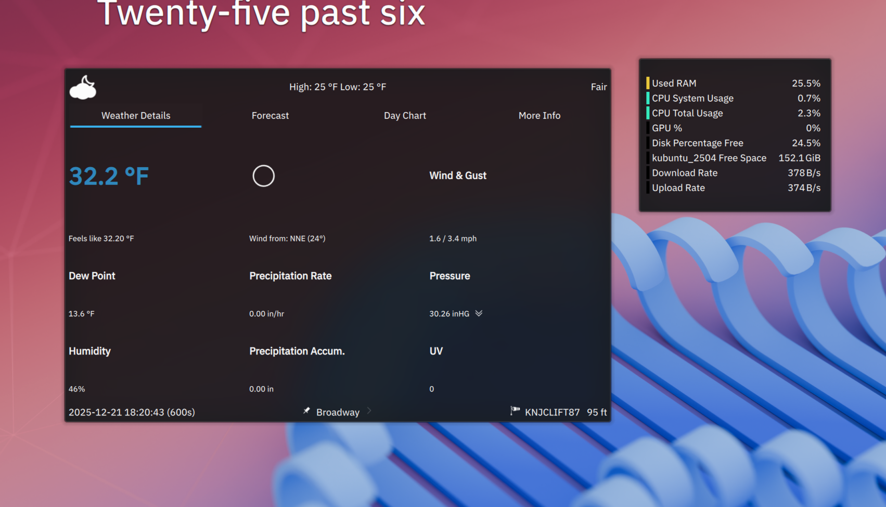

When I decided to rebuild my website, I knew I wanted to develop it in a Linux desktop virtual environment on a VM. Why?

I've experimented with Linux for decades. I played around with [Red Hat Linux](https://www.redhat.com/en/technologies/linux-platforms/enterprise-linux) in the early 2000s at my first tech writing job. I *tried* to understand [OpenSUSE](https://www.opensuse.org/) on my [HP 2140 Netbook](https://www.wired.com/2009/01/hp-netbook-review) back in 2009 (eventually I installed Ubuntu). I even [gave a presentation about virtual machines (VMs)](https://www.slideshare.net/slideshow/creating-a-drupal-sandbox-using-virtualbox-and-drupal-quickstart/28217861) back in 2010.

Here's What inspired me to go this route:

- Compartmentalization. I love Windows and always have, but trying to configure my bread-and-butter machine to work with things I wasn't yet comfortable with added complexity and concern.
- Free! From the [VMWare Workstation](https://www.vmware.com/products/desktop-hypervisor/workstation-and-fusion) host to the operating system, the only thing it cost was some time and disk space (and it [changed the way I work](#my-new-daily-driver)).
- It allowed me to configure, test, and run static site generators (SSGs) like Hugo and Eleventy in the environments they'll eventually run.
- *Not* Apple. The only Apple product I've ever owned was an iPad 3 and I hated every minute of it.
- It's *fast*, and the environment is incredibly customizable.
- Easy to learn. Most apps you're familiar with have a different name and a different UI.
- For the development and writing tasks of this project, it *just worked*.
- Press `Pause` on the VM and you're done for the day.

## How to start using a VM

When I said *some* time, that wasn't entirely accurate. There's a learning curve to working with Linux. You need to install and configure many development tools and frameworks by command line interface (CLI), like a VPN, or NodeJS, or an SSG, which is something you'd do with any platform. If this sounds like a lot, there are Windows or Mac apps that will do a lot of it for you. Once you get over that curve, you mostly spend your time using cross-platform apps and technologies like VS Code, GitHub, and OpenOffice.

You *do* have to make some decisions, and test them, but some are actually fun.

- Choosing a virtual machine (VM) host &mdash; I was surprised to learn [VMWare Workstation](https://www.vmware.com/products/desktop-hypervisor/workstation-and-fusion) was much quicker than [VirtualBox](https://www.virtualbox.org), which I used for years.
- Trying out "flavors" of Linux if you have the time and inclination. I tried distributions (distros) like Fedora and Ubuntu; due to my familiarity with Ubuntu and self-imposed deadlines, it won.
- Then there are desktop environments like GNOME and Kubuntu. For me, the Ubuntu-based [Mint Cinnamon](https://linuxmint.com/edition.php?id=302) *just worked*. I bought a laptop and installed Mint on it, which was incredibly painless to install and configure.
- Each VM and distro I tested were straightforward in terms of setup and had lots of handholding, as well as [pretty good documentation](https://linuxmint.com/documentation.php).

### And then one day&hellip;

One day I opened my VM to find it no longer had internet connectivity. My host (Windows) computer had access, other VMs I was testing had connectivity, so *something* happened to my working version. An hour or so searching and the answer was&hellip; well, I'm not sure. It's *possible* that it broke from an update, but I lost time trying to find the right magic commands.

The good news is that if you do this in a VM, it's far easier to recover without affecting your daily machine. I just started over with a new virtual machine. My code was in GitHub, so it made it much quicker to recover and keep working after I reinstalled .

## My new daily driver

Fast-forward a year and I outgrew Mint. Kubuntu is my daily OS. No matter what OS you choose, you'll find it's much more customizable than Windows.

I only boot into Windows to play motorsport games with a sim-racing rig. Everything else &mdash; including my [favorite city-building game](https://www.paradoxinteractive.com/games/cities-skylines-ii/about) &mdash; run great in Linux. I've even created my own homelab based on Linux.

## Conclusion

Working in a virtual environment provided a teaching moment, separated work from daily life, and eventually led to a complete change in how I use my computers daily. I don't always love the learning curve, but I have zero regrets in choosing to build my site this way.