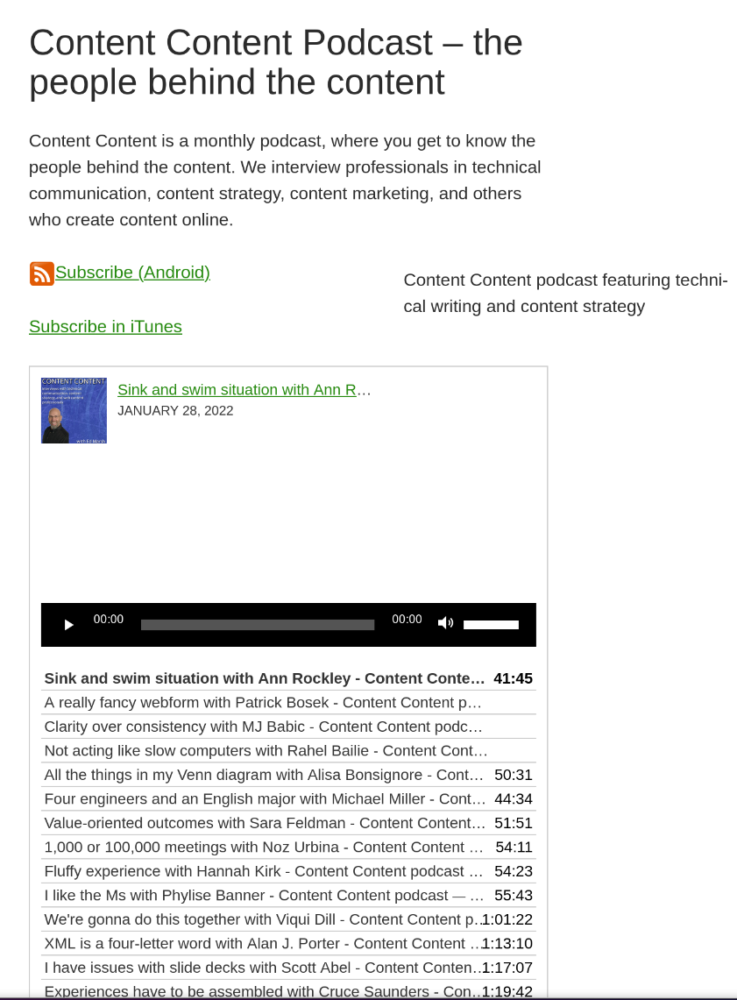

I've always been [curious and dabbled in about development](/skills/code-development), which is why when I decided to update my site, getting seriously hands-on was an appeal to me. I've built websites starting in 1996, including the WordPress site I built in 2008. That site and its scope expanded when I started my podcast in 2015.

I also took this on to understand how content I create is consumed and displayed to users.

Ultimately, taking on this project was strategic. My contract ended at the end of 2024. I don't have any recent writing samples that I could share with potential employers due to intellectual property (IP) laws, which I take seriously. The public-facing samples I *did* write were woefully out-of-date, as was my WordPress site. I didn't realize *just* how out-of-date the site was until I got deep into this project.

This was that rare opportunity to review 15 years' worth of content, get rid of cruft, reduce my hosting costs, learn some things, and update my portfolio.

## Technical goals

- Update a 10-year-old design.
- Retire a complex WordPress site that didn't get much traffic and needed maintenance.
- Quickly ("quickly") revamp my website to increase my chances at getting hired.
- Add value by developing with SSGs, which isn't a skill a lot of technical writers have.
- Learn newer technologies (that leverage old ones like HTML and CSS).

## Content goals

- Have a steady stream of blog content that I can drive traffic to and show as writing samples.
- Give back to the community by documenting the static site implementation process.
- Review all the content on my site and see if and how it's promoting me in the best light.
- Decide whether to archive old content, like those *very* early blog posts.
- Understand how to structure content not only for SSGs, but other programmatic use.
- Enjoy writing again.
- Do something for *me*.

## Cost goals

Financial and personal/time costs:

- Reduce the overhead of maintaining a content management system. I haven't blogged in some time, and my [podcast](/podcasts) has been on hiatus since 2022 (stay tuned&hellip;). Maintenance included all of the plugins I used, as well as WordPress itself. On top of that, hundreds of spam comments came through every day that had to be addressed.
- Reduce hosting costs. SSGs don't require a lot of infrastructure like a database, so they can be hosted in places that WordPress sites can't. This gave me flexibility to move to a zero- or low-cost host. That *doesn't* mean there are zero costs to hosting the site:
- My existing site host was also my mail server, so I had to find and set up an alternative (and my first choice was too difficult to set up).
- I had to upgrade my podcast hosting so I could get metrics from them and have them deal with all of the traffic. My podcast archive puts me at the limit of free disk space and bandwidth on GitHub, so I had to offload that burden to a paid service.
- By downsizing from a web host I'd undergrown, I could re-allocate resources to mail and podcast hosting, which in aggregate are far cheaper, but also added the burden of having to administer a mail server. It also required me to learn how to configure DNS records to point to my new host and mail server.

## My use case

Here are my initial structure thoughts that changed as I built things out:

- Home - promotes posts across all of the content types &mdash; podcast, writing samples, skills, and this SSG series.
- About
- List of skills of all the ways I can help a potential client/employer
- Podcast
- Tech writing examples - gallery page
- Speaking engagements/presentations
- Blog (etc) - gallery page
- Podcast pages  - gallery page
- A sidebar that displays a tag cloud
- photo galleries (?)
- Contact
- Resume(?)

Very few parts of this structure ended up in version 1.0 of the site. If you've ever revamped lots of legacy content, this probably isn't surprising. I intend to keep this site more updated than the last one (!remindme 1 year).

## The what

[Choosing a static site generator](../choosing-static-site-generator)